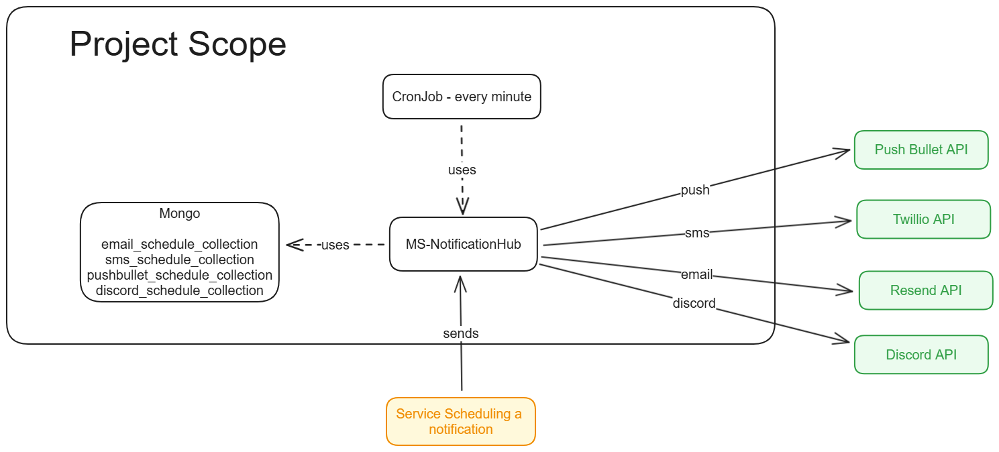
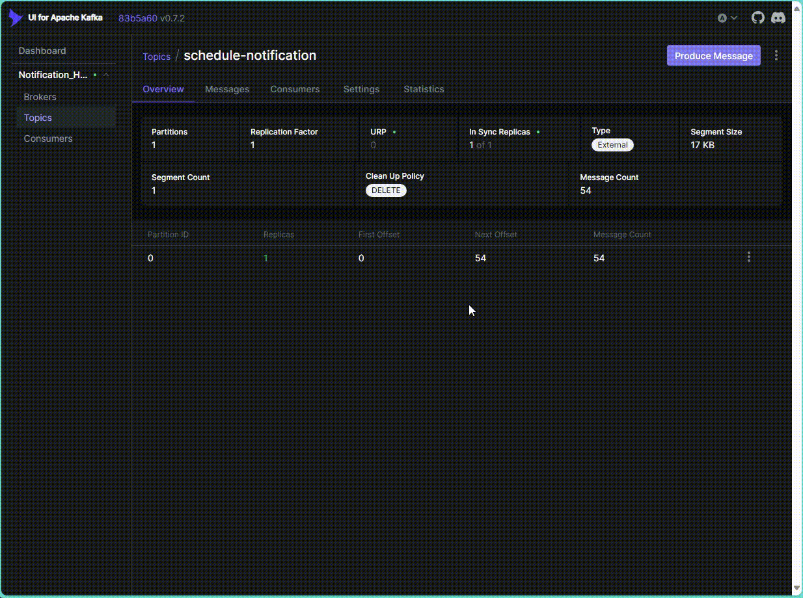
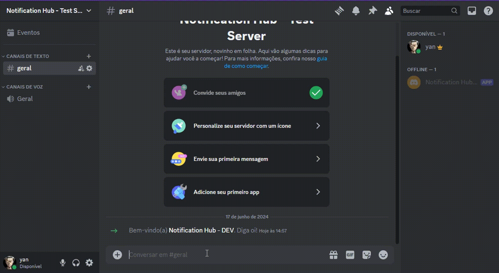
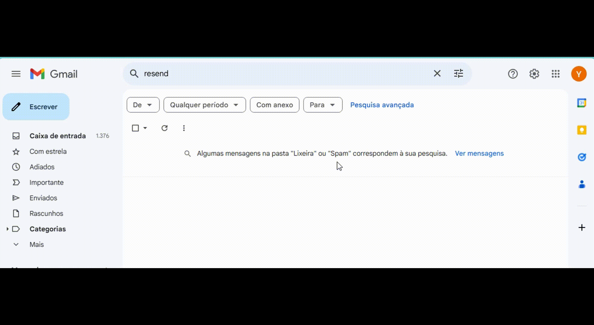

<h1 align="center" style="font-weight: bold;">Notification Hub🛎️</h1>

<p align="center">
<a href="#tech">Technologies</a>
<a href="#started">Getting Started</a>
</p>


<p align="center">This project is responsible for scheduling a notification. Currently have 4 methods of notification.

- Email with Resend API
- SMS with Twillio API
- Push with Pushbullet
- Discord with Discord Bot API (sending a message to a room of a server)
</p>


<h2 id="technologies">💻 Technologies</h2>

- JAVA 17
- Spring boot
- MongoDB
- Feign Client
- Maven
- Kafka

<h2 id="started">🚀 Getting started</h2>

Before running the project it needs to install the dependencies.

Run on terminal `mvn clean package`.

After successfully installed, then it needs the Kafka and MongoDB containers to be up.

Run on the terminal `docker compose up -d`.

<h3>Prerequisites</h3>

- JAVA 17
- Docker
- Maven

<h3>Cloning</h3>

How to clone your project

```bash
git clone https://github.com/hi-im-yan/notification-hub.git
```

<h3>Config .env variables</h2>

Use the `.env.example` as reference to create your server configuration.

```yaml
NOTIFICATION_HUB_MONGO_HOST=localhost
NOTIFICATION_HUB_MONGO_PORT=27017
NOTIFICATION_HUB_MONGO_DATABASE=notification_hub
NOTIFICATION_HUB_KAFKA_SERVERS=localhost:9092
```

<h3>Starting</h3>

How to start your project

```bash
mvn spring-boot:run
```

<h3>Documentations that might help</h3>

[💾 Commit Pattern](https://www.conventionalcommits.org/en/v1.0.0/)

[⌬ Hexagonal Architecture](https://netflixtechblog.com/ready-for-changes-with-hexagonal-architecture-b315ec967749)
<h3>Project Scope</h3>



<h3>How to use</h3>

<h4>Scheduling a notification</h4>

Before scheduling a notification, the sender must have a configuration on "sender_configuration" collection on mongodb.
There is some json examples that should help configure your first sender, please search on "documentation" folder.

For scheduling we will use Kafka.






